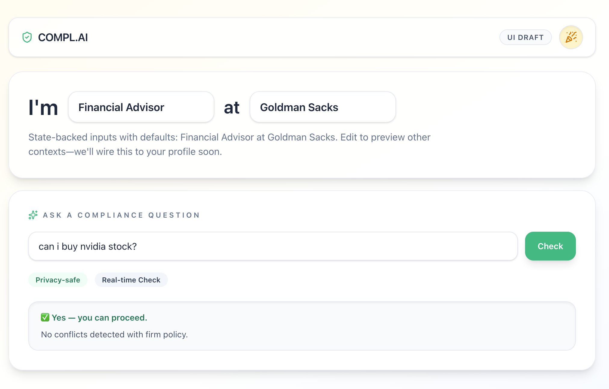
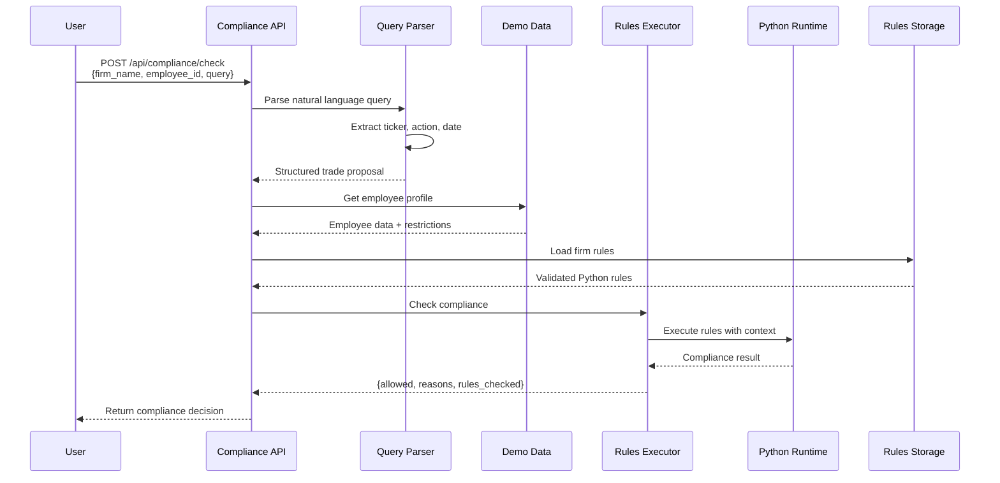

# Compl.ai – Personal Trading Compliance Assistant

Compl AI is an AI‑powered personal trading compliance assistant that helps financial industry employees understand **what they can and cannot trade**—instantly, in plain language, and fully aligned with their firm's real policies and regulatory obligations.

---

## The Problem

Financial services firms impose strict personal trading rules on employees, leading to:

- **Complex, fragmented rules** across firm policies, SEC/FINRA/CFTC/MiFID, and PCAOB requirements
- **High operational burden** with hundreds of daily "Can I trade X?" emails requiring manual checks
- **Poor employee experience** with slow, inconsistent responses and limited transparency
- **Limited analytics** for compliance teams to identify friction points

The result: a process that feels like **"email + PDF + wait 2 days"** instead of a modern workflow.

---

## The Solution

Compl AI is a **chat‑first compliance assistant** that provides instant, policy‑checked answers to trading questions.

### Key Features

- **Natural language interface** – Ask "Can I trade Tesla this week?" and get clear yes/no answers with reasoning
- **Firm‑specific policy engine** – Converts PDF policies into structured rule models for deterministic evaluation
- **Role‑aware personalization** – Uses employee profile (role, business unit, MNPI access) to apply relevant rules
- **Pre‑clearance workflow** – Auto‑builds and submits pre‑clearance requests when required
- **Full auditability** – Complete logs of all questions, decisions, and rule snapshots

---

## How It Works

1. **Policy Ingestion** – Converts firm policies (personal trading, insider trading, codes of ethics) into structured JSON schemas with roles, rule types, and constraints

2. **Context Modeling** – Models employees, household members, accounts, issuers, and engagements to understand the full compliance context

3. **NLP Parsing** – Extracts trade intent and parameters (ticker, side, timeframe, size) from natural language questions

4. **Rules Engine** – Evaluates trade proposals against policy rules using role‑based scoping, issuer classification, and policy constraints

5. **Response & Workflow** – Returns clear answers with explanations, auto‑generates pre‑clearance requests, and escalates edge cases

6. **Analytics** – Tracks usage patterns, decision outcomes, and provides configurable alerts

---

## Compliance Check Flow

